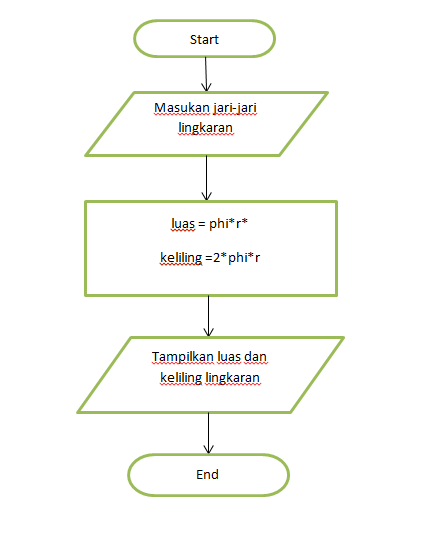
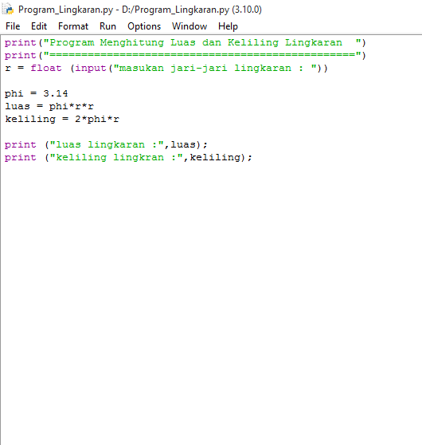
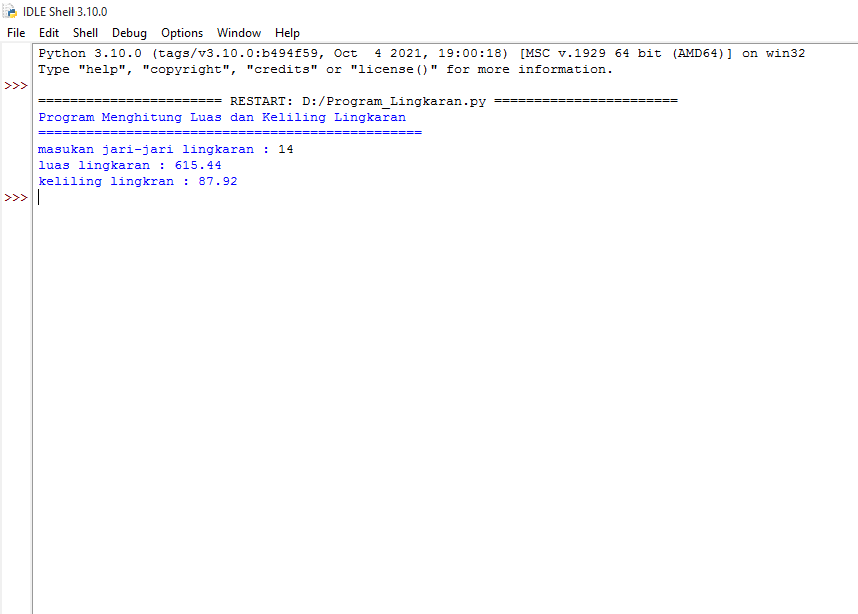

# Latihan 3
## Menghitung Keliling dan Luas Lingkaran

## Rumus

Luas     = π × r × r
Keliling = 2 × π × r

-Phi adalah nilai konstanta dalam matematika yang merupakan rasio keliling lingkaran dengan diameternya. 
-phi memiliki nilai 3,14 atau 22/7. Pada program yang saya buat ini menggunakan nilai 3,14.

## Flowchart 

## Program

## Penjelasan

-Deklarasikan variable r dan memasukkan nilai jari-jari lingkaran yang bertipe float, selanjutnya membuat variable phi dengan nilai 3.14 dan mendeklarasikan variable luas dimana variable phi dikali variable r lalu dikalikan lagi dengan variable r. Lalu hasilnya akan dimasukkan kedalam variable luas.

-Sama halnya dengan variable luas, namun variable keliling ini memiliki rumus yang berbeda yaitu 2 dikali variable phi dan dikali variable r dan hasilnya dimasukkan kedalam variable keliling.

-Terakhir menampilkan nilai dari variable luas dan keliling lingkaran.

### Ouput

### SELESAI
